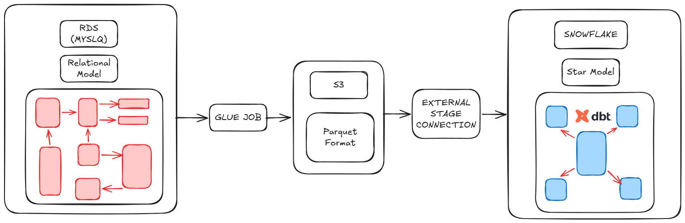

# SIMPLE ELT PIPELINE: FROM RDS TO SNOWFLAKE

This is a simple pipeline that moves relational data from an RDS instance (MySQL) to Snowflake, and uses dbt to transform the data into a Star Schema.

#### PRINCIPAL ARCHITECTURE:


## REQUIREMENTS
- **Terraform** installed.
- **AWS CLI** configured with permissions to manipulate and create:
    - S3
    - EC2
    - GLUE 
    - RDS 
    - VPC
    - IAM
- An **S3 bucket** ready to store the Terraform backend state.
- A **Snowflake Account** with permissions to create databases, schemas, and external stages (`ACCOUNTADMIN` or `SYSADMIN`).
- **uv** library installed for Python environment management.

---

## SET UP

This project manages multiple cloud services and technologies, so the setup is divided into two main parts: Infrastructure (Terraform) and Transformation (dbt).

### 1. SET UP TERRAFORM (Infrastructure)

1. Rename `backend.hcl.example` to `backend.hcl` and fill in the necessary data for your AWS backend (you must already have an S3 bucket in your account).
2. Rename `terraform.tfvars.example` to `terraform.tfvars` and fill in the required variables for the infrastructure.
3. Apply the initial infrastructure by running the following commands in order:
    ```bash
    cd terraform
    terraform init -backend-config="backend.hcl"
    terraform apply -auto-approve
    ```
    *Note: This command will output the AWS IAM Role ARN, which is required for Snowflake to establish the external stage connection.*
4. Retrieve the `snowflake_iam_user_arn` and `snowflake_external_id` from your Snowflake console (using `DESCRIBE INTEGRATION...`), and run the following command to update the AWS Trust Policy:
    ```bash
    terraform apply -var="snowflake_iam_user_arn=<YOUR_ARN>" -var="snowflake_external_id=<YOUR_ID>" -auto-approve
    ```
5. Trigger the AWS Glue Job to move the data. You can do this from the AWS Console or via CLI:
    ```bash
    aws glue start-job-run --job-name <glue_job_name_output>
    ```
    To check the job status, run:
    ```bash
    aws glue get-job-run --job-name <glue_job_name_output> --run-id <run_id_returned_previously>
    ```
6. Once the Glue Job succeeds, populate the tables in Snowflake by executing the SQL commands located in `./terraform/scripts/PopulatedTables.sql` within your Snowflake worksheet.

If you get here, the base infrastructure and raw data are ready!

---

### 2. SET UP DBT (Transformation)

1. Navigate to the dbt project folder and install the exact dependencies using `uv`:
    ```bash
    cd ../dbt_chinook
    uv sync
    ```
2. Copy the profile template to set up your Snowflake connection details:
    ```bash
    cp ./transform_chinook/profiles.yml.example ./transform_chinook/profiles.yml
    ```
    *Open `profiles.yml` and fill in your Snowflake account, user, and password.*
3. Install dbt external packages (if any) and test the connection:
    ```bash
    uv run dbt deps
    uv run dbt debug
    ```
4. Once the debug shows a successful connection, execute the transformation pipeline:
    ```bash
    uv run dbt run
    ```

**Congratulations! The ELT pipeline is fully functional and your Star Schema is ready for analytics.**

### SET DOWN

If you want to remove all the services follow the next steps:

1. DELETE the dbt schemas from the snowflake database, you can use SQL DDL commands
    ```SQL
    DROP SCHEMA NAME_SCHEMA;
    ```
    *Note: You need to drop the intermediate and marts schemas*
2.  run:
    ```bash
    terraform destroy
    ```